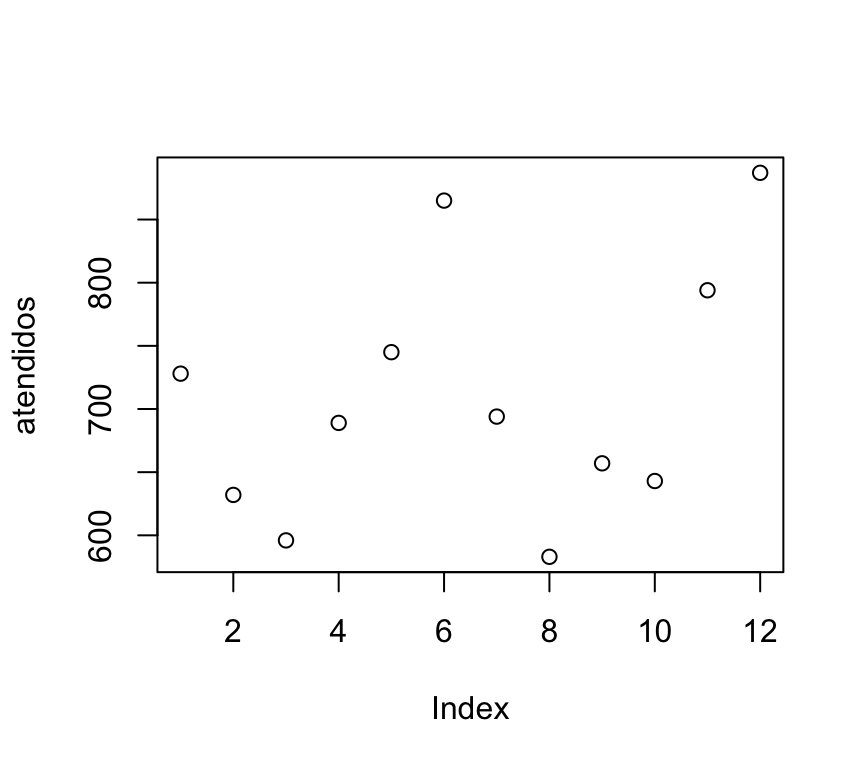
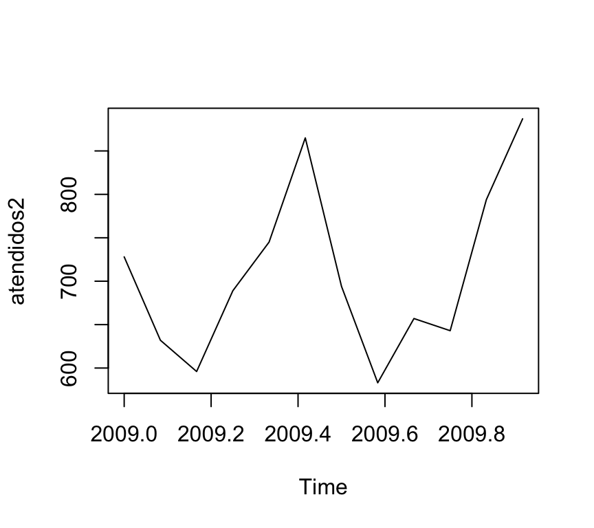

<!-- see http://rmarkdown.rstudio.com/ for details in formatting -->


---

> ***Help operator***: R provee el operador `?` para conocer las opciones y parámetros de las instrucciones. Ej: `help("paste")` o `?paste`.  

---

# Objetos

En términos genéricos, todos los elementos que maneja R son objetos: un valor numérico es un objeto, un arreglo es un objeto, una función es un objeto, una base de datos es un objeto, un gráfico es un objeto, …

Para realizar un uso eficiente de R es preciso entender y aprender a manipular bien las distintas clases de objetos que maneja el programa. En esta sección nos vamos a ocupar particulamente de aquellos objetos que R utiliza para representar datos: valores, vectores, matrices, dataframes, series temporales y listas.

R utiliza, de hecho, programación orientada a objetos. Ello significa que una misma función hace cosas distintas según la clase del objeto que recibe como argumento, pudiendo incluso no hacer nada (o producir un error) si se le pasan argumentos de una clase inadecuada.

A modo de ejemplo, veamos cómo la función `plot()` puede mostrar distintos gráficos según la clase del objeto a representar. Para ello supongamos que el siguiente arreglo representa el número de personas atendidas mensualmente en el servicio de urgencias de un centro de salud durante el año 2000 (datos de enero a diciembre):


```r
atendidos <- c(728,632,596,689,745,865,694,583,657,643,794,887)
atendidos
```

```
##  [1] 728 632 596 689 745 865 694 583 657 643 794 887
```

La asignación de valores a un variable se realiza a través del operador `<-`. En este caso, la variable `atendidos` recibe 12 números. 


```r
class(atendidos)
```

```
## [1] "numeric"
```

La función `class()` nos devuelve la clase del objeto atendidos, que como vemos es `numeric`. Podemos obtener una representación gráfica de este arreglo simplemente mediante:


```r
plot(atendidos)
```

<!-- -->

Ahora convertimos estos datos en serie temporal mediante la función ts(), indicando que esta serie comienza en enero del año 2009 y que tiene una frecuencia de 12 observaciones por año (esto es, una por mes):


```r
atendidos2 <- ts(atendidos,frequency=12,start=c(2009,1))
atendidos2
```

```
##      Jan Feb Mar Apr May Jun Jul Aug Sep Oct Nov Dec
## 2009 728 632 596 689 745 865 694 583 657 643 794 887
```


```r
class(atendidos2)
```

```
## [1] "ts"
```

Como podemos ver, la clase del objeto `atendidos2` es `ts` (time series). Podemos comprobar que si aplicamos la misma función `plot()` a `atendidos2`, el gráfico obtenido es distinto que cuando se aplica a `atendidos`, aún cuando los datos sean exactamente los mismos:


```r
plot(atendidos2)
```

<!-- -->

---

# Paquetes

Una de las grandes potencialidades que tiene R es la utilización de paquetes (o librerías). R tiene una serie de comandos que se cargan por default. Sin embargo, hay una gran cantidad de funcionalidades que se deben cargar a través de paquetes. 

Un paquete (package) es una colección de funciones, datos y código R que se almacenan en una carpeta conforme a una estructura bien definida, fácilmente accesible para R. En la web de R se puede consultar la lista de paquetes disponibles.

Puede haber paquetes: 
* **Instalados en R pero que no están en memoria**. Son paquetes que se han descargado junto con la instalación de R pero que, para su uso, se requiere cargarlos en memoria. Ejemplo: 


```r
library("plyr")
```

* **No instalados en R**. Son paquetes que 1º debes instalar y luego cargarlos en memoria. Por ejemplo: 


```r
if (!is.element("readr", installed.packages()[,1])){
  install.packages("readr", repos = "http://mirror.fcaglp.unlp.edu.ar/CRAN/")
}
library("readr")
```

* **En memoria**. Estos paquetes se cargan automáticamente en memoria cuando se agre Rstudio, o cuando se utiliza R. 

Veamos un ejemplo:

R posee, en memoria, una tabla-ejemplo llamada `airquality`. Se puede ver por consola escribiendo su nombre+Enter. Si quisieramos cambiar el signo de los valores de la columna "Ozone", podríamos cargar el paquete "plyr" que contiene la función "mutate()". Este paquete ya está instalado pero se requiere cargarlo en memoria. Para eso vamos a cargar en memoria el paquete: 


```r
library("plyr")
```

Ahora que el paquete está en memoria, podemos ejecutar la instrucción: 


```r
head(mutate(airquality, Ozone = -Ozone))
```

```
##   Ozone Solar.R Wind Temp Month Day
## 1   -41     190  7.4   67     5   1
## 2   -36     118  8.0   72     5   2
## 3   -12     149 12.6   74     5   3
## 4   -18     313 11.5   62     5   4
## 5    NA      NA 14.3   56     5   5
## 6   -28      NA 14.9   66     5   6
```

Y podremos ver por consola cómo combió el signo. 

En el area ***File/Plots/Packages/Help/Viewer:***, si haces click en "Packages" podrás ver un listado de paquetes, y qué paquetes tienes instalados. Puedes instalar paquetes haciendo click en "Install".

En [este link](https://cran.r-project.org/web/packages/index.html) puedes ver un listado completo de paquetes disponibles. 

---

# Tipos básicos de datos

R distingue los siguientes tipos de variables:

+ **numeric**: variables numéricas continuas.


```r
a <- 2.15
```

+ **integer**: variables numéricas discretas.


```r
b <- 3
c <- as.integer(a) # para transformar un variable float en entera. 
```

+ **character**: variables alfanuméricas; sus valores son combinaciones de cifras y letras.
+ **factor**: variables categóricas; R almacena internamente los valores de un factor como números enteros, pero los muestra como valores alfanuméricos.

## Factores

Un factor es una variable categórica con un número finito de valores o niveles. En R los factores se utilizan habitualmente para realizar clasificaciones de los datos, estableciendo su pertenencia a los grupos o categorías determinados por los niveles del factor.

Los factores juegan un papel muy importante en la elaboración de modelos estadísticos. En particular, los modelos lineales pueden dar resultados muy diferentes según que una variable se declare como numérica o como factor.

Los niveles de un factor puede estar codificados como valores numéricos o como caracteres. Independientemente de que el factor sea numérico o carácter, sus valores son siempre almacenados internamente por R como números enteros, con lo que se consigue economizar memoria.

Consideremos el siguiente ejemplo. La variable:


```r
sexo <- c("M", "H", "M", "M", "M", "H", "M", "M", "H", "H")
sexo
```

```
##  [1] "M" "H" "M" "M" "M" "H" "M" "M" "H" "H"
```

puede ser considerada un factor, ya que establece para cada sujeto su pertenencia a una de las dos categorías “Hombre”" o “Mujer”. Para que R reconozca al sexo como factor, una vez introducidos los datos utilizamos la función:


```r
sexo <- factor(sexo)
sexo
```

```
##  [1] M H M M M H M M H H
## Levels: H M
```

con lo que hemos convertido sexo en un factor con dos niveles M y H. En muchos casos, los niveles del factor son poco ilustrativos de su significado. La siguiente sintaxis especifica explícitamente los niveles del factor (levels) y asigna etiquetas (labels) a cada uno de ellos:


```r
sexo <- factor(sexo,levels=c("H","M"),labels=c("Hombre","Mujer"))
sexo
```

```
##  [1] Mujer  Hombre Mujer  Mujer  Mujer  Hombre Mujer  Mujer  Hombre Hombre
## Levels: Hombre Mujer
```

Estas etiquetas aparecerán en los resultados de los procedimientos estadísticos donde apareza el factor, aclarando su significado. Por ejemplo, si pedimos a R que nos construya la tabla de frecuencias de sexos, en lugar de H o M nos mostrará los términos “Hombre”" o “Mujer”:


```r
table(sexo)
```

```
## sexo
## Hombre  Mujer 
##      4      6
```

Hay alguna funciones en R que requieren que la variable de entrada sea necesariamente un factor (aún cuando la variable esté codificada numéricamente). Para ello basta recodificar la variable original como factor. Por ejemplo, supongamos que se ha registrado la producción de tres máquinas (identificadas como 27, 32 y 55) durante cinco días sucesivos, dando como resultado los siguientes datos:


```r
produccion=c(120,100,132,112,95,164,172,183,155,176,110,115,122,108,120)
maquina=c(27,27,27,27,27,32,32,32,32,32,55,55,55,55,55)
dia=c(1,2,3,4,5,1,2,3,4,5,1,2,3,4,5)
cbind(maquina,dia,produccion)
```

```
##       maquina dia produccion
##  [1,]      27   1        120
##  [2,]      27   2        100
##  [3,]      27   3        132
##  [4,]      27   4        112
##  [5,]      27   5         95
##  [6,]      32   1        164
##  [7,]      32   2        172
##  [8,]      32   3        183
##  [9,]      32   4        155
## [10,]      32   5        176
## [11,]      55   1        110
## [12,]      55   2        115
## [13,]      55   3        122
## [14,]      55   4        108
## [15,]      55   5        120
```

Si se pretende evaluar la producción de estas tres máquinas a lo largo de estos días, es evidente que sus números de identificación (27, 32 y 55) son simples etiquetas sin que su valor intrínseco tenga ningún sentido en el problema. En este caso resulta razonable (y, como veremos, en el ajuste de modelos de análisis de la varianza es además necesario) convertir esta variable en factor. Para ello simplemente ejecutamos:


```r
maquina=factor(maquina)
maquina
```

```
##  [1] 27 27 27 27 27 32 32 32 32 32 55 55 55 55 55
## Levels: 27 32 55
```

### Coerción de factores

Un factor puede convertirse en variable numérica mediante la función as.numeric(). Ahora bien, dichas conversiones deben realizarse con cierta precaución. Así por ejemplo, si en el caso anterior aplicamos la función as.numeric() al factor maquina obtenemos:


```r
as.numeric(maquina)  
```

```
##  [1] 1 1 1 1 1 2 2 2 2 2 3 3 3 3 3
```

¡No se han recuperado los valores originales 27, 32 y 55!. Lo que ocurre en este caso es que R muestra la codificación interna de los niveles del factor (habitualmente valores enteros ordenados desde 1 hasta el número total de niveles). Si quisiéramos recuperar los valores numéricos originales de la variable maquina debemos primero convertirla en carácter, y a continuación en numérica:


```r
as.numeric(as.character(maquina))
```

```
##  [1] 27 27 27 27 27 32 32 32 32 32 55 55 55 55 55
```

## Variables lógicas

Las variables lógicas constituyen un tipo particular de factor en R, que se caracteriza por tomar sólo dos valores: **TRUE** o  **FALSE** codificados, respectivamente, como 1 y 0. Es posible construir condiciones lógicas utilizando los operadores ‘y’ (`&`), ‘o’ (`|`) y ‘no’ (`!`). 

La comparación de valores se lleva a cabo mediante `==` (‘es igual a’) y `!=` (‘es distinto de’).

ATENCIÓN: No debe confundirse el operador de asignación = con el de comparación ==.

Veamos algunos ejemplos:


```r
a <- 2
b <- 4
a==b  # ¿es a igual a b?
```

```
## [1] FALSE
```

```r
a!=b  # ¿es a distinto de b?
```

```
## [1] TRUE
```

```r
(a<3)&(b<5)  # ¿es a menor que 3 y b menor que 3?
```

```
## [1] TRUE
```

```r
(a<1)|(b<3)  # ¿es a menor que 1 o b menor que 3?
```

```
## [1] FALSE
```

Funciones any() y all()

Las funciones any(x) y all(x) determinan, respectivamente, si alguno o todos los elementos de x son TRUE:


```r
any(c(a==2, a==3, a==4))
```

```
## [1] TRUE
```

```r
any(c(a==3, a==4, a==5, a==6))
```

```
## [1] FALSE
```

```r
all(c(a==2, b==4, 2<3))
```

```
## [1] TRUE
```

# Arreglos

Se pueden agrupar varios elementos de la misma clase para formar un arreglo mediante el comando de concatenación `c()`. Así, podemos guardar las edades de 10 personas de una muestra en la variable edad mediante:


```r
edad <- c(22, 34, 29, 25, 30, 33, 31, 27, 25, 25)
edad
```

```
##  [1] 22 34 29 25 30 33 31 27 25 25
```


```r
class(edad)
```

```
## [1] "numeric"
```

## Longitud

La función `length()` devuelve la longitud (número de elementos) del arreglo:


```r
x <- c(1,4,5,2,4,5,4,3,2,2,3,2,2,4,4,5,5,6,6,7)
length(x)
```

```
## [1] 20
```

## Acceso a los componentes

Es posible acceder al valor que ocupa la posición `k` dentro de un arreglo `x` refiriéndonos a él como `x[k]`. Así, por ejemplo, podemos ver el contenido del tercer y quinto valores del arreglo `edad`:


```r
edad <- c(22, 34, 29, 25, 30, 33, 31, 27, 25, 25)
edad[3]
```

```
## [1] 29
```

```r
edad[5]
```

```
## [1] 30
```

### Operador `:`

Si deseamos asignar a una variable una sucesión de valores consecutivos podemos utilizar el operador `:`. Así para asignar a la variable x los valores de 1 a 10 procederíamos del siguiente modo:


```r
x <- 1:10
x
```

```
##  [1]  1  2  3  4  5  6  7  8  9 10
```

Podemos construir secuencias de números más complejas mediante la función `seq()`:

Sucesión de valores de 1 a 20 de 2 en 2:


```r
x <- seq(1,20,by=2)
x
```

```
##  [1]  1  3  5  7  9 11 13 15 17 19
```

Sucesión de 8 valores equiespaciados entre 1 y 20:


```r
y <- seq(1,20,length=8)
y
```

```
## [1]  1.000000  3.714286  6.428571  9.142857 11.857143 14.571429 17.285714 20.000000
```

Podemos acceder también simultáneamente a varios valores dentro de un arreglo. Por ejemplo, si deseamos ver del segundo al quinto de los valores observados en la variable edad:


```r
edad[2:5]
```

```
## [1] 34 29 25 30
```

Y si quisiéramos ver sólo los valores primero, tercero y séptimo:


```r
edad[c(1,3,7)]
```

```
## [1] 22 29 31
```

### Operador `%in%

La función %in% permite determinar si uno o varios valores están contenidos en un arreglo:


```r
x <- 1:10
a <- 2
a %in% x
```

```
## [1] TRUE
```


```r
b <- c(6,8,14,2,15)
b %in% x
```

```
## [1]  TRUE  TRUE FALSE  TRUE FALSE
```

## Selección condicionada de valores

La función `which()` nos da las posiciones, dentro de un arreglo, de los valores que cumplen cierta condición. Por ejemplo, si definimos:


```r
edad <- c(22, 34, 29, 25, 30, 33, 31, 27, 25, 25)
```

La siguiente función nos devuelve las posiciones de los valores de este arreglo que son mayores que 25:


```r
which(edad>25)
```

```
## [1] 2 3 5 6 7 8
```

Esto es: los valores del arreglo `edad` mayores que 25 son los que ocupan las posiciones 2, 3, 5, 6, 7 y 8.

Podemos asignar estas posiciones a una nueva variable:


```r
mayores25 <- which(edad>25)
```

y utilizarla para mostrar cuáles son concretamente esos valores mediante:


```r
edad[mayores25]
```

```
## [1] 34 29 30 33 31 27
```

Esta expresión puede simplificarse, si no utilizamos `which()`:


```r
edad[edad>25]
```

```
## [1] 34 29 30 33 31 27
```

La operación `which()` es aplicable también a otras estructuras de datos en R. Es, en efecto, un operador potente para la ciencia de datos. 

Se puede realizar también la selección de valores de un arreglo condicionando por los valores de otro arreglo. Por ejemplo, si las diez edades del ejemplo anterior corresponden a personas cuyo sexo viene dado por:


```r
sexo <- c("M","H","H","M","M","H","M","M","H","H")
```

podríamos seleccionar la edad de las mujeres simplemente mediante:


```r
edad[sexo=="M"]
```

```
## [1] 22 25 30 31 27
```

## Función `unique()`  

Es frecuente que, dado un conjunto de datos, nos interese solamente conocer los valores, sin importar su repetición en el conjunto: 


```r
unique(sexo)
```

```
## [1] "M" "H"
```

## Función `table()`  

Si quisieramos conocer cuántas repeticiones tiene cada elemento se puede utilizar: 


```r
table(edad)
```

```
## edad
## 22 25 27 29 30 31 33 34 
##  1  3  1  1  1  1  1  1
```

## Operaciones con variables numéricas

Si `x` e `y` son dos arreglos de la misma dimensión, las operaciones elementales se realizan término a término (característica que se conoce como aritmética vectorial):


```r
x <- seq(2,20,by=2)  # Números pares entre 2 y 20
x
```

```
##  [1]  2  4  6  8 10 12 14 16 18 20
```

```r
y <- seq(1,20,by=2)  # Números impares entre 1 y 20
y
```

```
##  [1]  1  3  5  7  9 11 13 15 17 19
```

```r
x+y
```

```
##  [1]  3  7 11 15 19 23 27 31 35 39
```

```r
x-y
```

```
##  [1] 1 1 1 1 1 1 1 1 1 1
```

```r
x*y
```

```
##  [1]   2  12  30  56  90 132 182 240 306 380
```

```r
x/y
```

```
##  [1] 2.000000 1.333333 1.200000 1.142857 1.111111 1.090909 1.076923 1.066667 1.058824 1.052632
```

## Operaciones con arreglos de clase `character`.

En R se pueden declarar arreglos alfanuméricos (o de clase carácter):


```r
letras <- c("a","b","c","d")
class(letras)
```

```
## [1] "character"
```

* `paste()`: esta función “pega” (o concatena) variables de clase `character`; la opción `sep` indica el símbolo que separa los valores que se han pegado; en caso de que no se quiera dejar ningún símbolo de separación, debe usarse `sep=""`:


```r
paste("A","B",sep="-")
```

```
## [1] "A-B"
```

Podemos pegar arreglos (se pegarán término a término: primer valor con primer valor, segundo con segundo, etc.)


```r
codigos <- paste(c("A", "B"), 2:3, sep = "")
codigos
```

```
## [1] "A2" "B3"
```

```r
codigos <- paste(c("A", "B"), 2:3, sep = ".")
codigos
```

```
## [1] "A.2" "B.3"
```

Obsérvese, que con la opción `sep` se obtiene como resultado un arreglo de la misma longitud que los arreglos que se pegan.

Cuando se utiliza `paste()` sobre un único arreglo con la opción `collapse`, se “pegan” todos los términos del arreglo en un único valor:


```r
paste(c("una", "frase", "simple"), collapse = " ")
```

```
## [1] "una frase simple"
```

### Selección/asignación de una parte de una cadena de caracteres.

La función `substr(x,n1,n2)` selecciona los caracteres de `x` entre las posiciones `n1` y `n2`. También permite realizar asignaciones:


```r
substr("abcdef", 2, 4)
```

```
## [1] "bcd"
```

```r
x <- "ABCDEF"
x
```

```
## [1] "ABCDEF"
```

```r
substr(x, 3, 5) <- c("uv")
x
```

```
## [1] "ABuvEF"
```

Tarea: 

Utiliza la ayuda de R para averiguar la utilidad de las funciones  `nchar`, `grep`, `match`, `tolower`, `toupper`.

## El paquete `stringr`

El paquete [`stringr`](https://cran.r-project.org/web/packages/stringr/index.html) ofrece funciones para el manejo de caracteres. Como este paquete no viene con R, hay que instalarlo y cargarlo en memoria: 


```r
if (!is.element("stringr", installed.packages()[,1])){
  install.packages("stringr")
}
library(stringr)
```

La siguiente tabla contiene algunas funciones de `stringr` para operar sobre caracteres:

| Function       | Description                             | Similar to    |
|:---------------|:----------------------------------------|:--------------|
| `str_c()`      | concatenación de string                 | `paste()`     |
| `str_length()` | número de caracteres                    | `nchar()`     |
| `str_sub()`    | extraer substrings                      | `substring()` |
| `str_dup()`    | duplicar caracterires                   | _none_        |
| `str_trim()`   | remover espacios blancos (inicio y fin) | _none_        |

# Matrices

En R las matrices solamente pueden ser numéricas y hay varias maneras de definirlas. Si es pequeña podemos utilizar la siguiente sintaxis:


```r
A <- matrix(nrow=3,ncol=3, c(1,2,3,4,5,6,7,8,9), byrow=TRUE)
```

Con el argumento `nrow` hemos indicado el número de filas de nuestra matriz, con `ncol` el número de columnas. A continuación hemos puesto los valores que forman la matriz (los valores del 1 al 9), y le hemos pedido a R que use esos valores para rellenar la matriz `A` por filas `(byrow=TRUE)´. La matriz A así construida es:


```r
A
```

```
##      [,1] [,2] [,3]
## [1,]    1    2    3
## [2,]    4    5    6
## [3,]    7    8    9
```

Tarea: 

Comprueba cómo queda la matriz si se utiliza `byrow=FALSE`.

Se pueden seleccionar partes de una matriz utilizando los índices de posición [fila, columna] entre corchetes. El siguiente ejemplo ilustra la forma de hacerlo:


```r
A[2,3]   # Se selecciona el valor de la fila 2, columna 3
```

```
## [1] 6
```

```r
A[2,]    # Se selecciona la fila 2 completa
```

```
## [1] 4 5 6
```

```r
A[,3]    # Se selecciona la columna 3 completa
```

```
## [1] 3 6 9
```

```r
A[1,2:3] # Se seleccionan el segundo y tercer valor de la fila 1
```

```
## [1] 2 3
```

Tarea:

1. Selecciona la submatriz de A formada por la primera y tercera filas
2. Selecciona la submatriz de A formada por las segunda y tercera columnas de la primera y segunda filas.

Si disponemos de varios arreglos de la misma longitud que queremos utilizar como filas (o columnas) de una matriz, podemos utilizar la función `rbind()` para unirlos por filas, o la función `cbind()` para unirlos por columnas, como vemos en el siguiente ejemplo:


```r
vector1 = c(1,2,3,4)
vector2 = c(5,6,7,8)
vector3 = c(9,10,11,12)
M1 = cbind(vector1,vector2,vector3) # Unimos por columnas
M1  
```

```
##      vector1 vector2 vector3
## [1,]       1       5       9
## [2,]       2       6      10
## [3,]       3       7      11
## [4,]       4       8      12
```

Tarea:

Crea una matriz M2 con los arreglos anteriores unidos por filas mediante `rbind()`. Compara el resultado con la matriz M1 anterior.

## Operaciones

La función `diag()` extrae la diagonal principal de una matriz:


```r
diag(A)
```

```
## [1] 1 5 9
```

Tarea: 

- Probar el resultado de las funciones diag(A), diag(c(1,2,3,4)), t(A), det(A), diag(1,nrow=4), A+2.
- Sumar dos matrices con la misma dimensión.  
- Multiplicar dos matrices con la misma dimensión. El operador es `%*%`.
- La inversa de una matriz utilizando solve(A).
- Obtener los autovalores y autovectores de A con eigen(A).

# Data.frames

El término “dataframe” es difícil de traducir al castellano. Podría traducirse como Hoja de datos o Marco de datos. Los dataframes son una clase de objetos especial en R. Normalmente, cuando se realiza un estudio estadístico sobre los sujetos u objetos de una muestra, la información se organiza precisamente en un dataframe: una hoja de datos, en los que cada fila corresponde a un sujeto y cada columna a una variable. La estructura de un data.frame es muy similar a la de una matriz. La diferencia es que una matriz sólo admite valores numéricos, mientras que en un dataframe podemos incluir también datos alfanuméricos. 

## Creación

El siguiente ejemplo nos muestra como crear un data.frame a partir de los datos recogidos sobre una muestra de 10 personas, para cada una de las cuales se ha registrado su edad, sexo y tiempo en minutos que estuvo hablando por teléfono el día antes de la encuesta:


```r
edad <- c(22, 34, 29, 25, 30, 33, 31, 27, 25, 25)
tiempo <- c(14.21, 10.36, 11.89, 13.81, 12.03, 10.99, 12.48, 13.37, 12.29, 11.92)
sexo <- c("M","H","H","M","M","H","M","M","H","H")
misDatos <- data.frame(edad,tiempo,sexo)
misDatos
```

```
##    edad tiempo sexo
## 1    22  14.21    M
## 2    34  10.36    H
## 3    29  11.89    H
## 4    25  13.81    M
## 5    30  12.03    M
## 6    33  10.99    H
## 7    31  12.48    M
## 8    27  13.37    M
## 9    25  12.29    H
## 10   25  11.92    H
```


```r
str(misDatos)    # Estructura de 'misDatos'
```

```
## 'data.frame':	10 obs. of  3 variables:
##  $ edad  : num  22 34 29 25 30 33 31 27 25 25
##  $ tiempo: num  14.2 10.4 11.9 13.8 12 ...
##  $ sexo  : Factor w/ 2 levels "H","M": 2 1 1 2 2 1 2 2 1 1
```


```r
names(misDatos)  # Nombre de las variables contenidas en 'misDatos'
```

```
## [1] "edad"   "tiempo" "sexo"
```

En este ejemplo hemos creado un data.frame llamado `misDatos` que contiene a las tres variables `edad`, `tiempo` y `sexo`. La función `str()` nos muestra la estructura de este objeto, confirmándonos que es un data.frame de tres variables con 10 observaciones cada una. Nos informa además de que las dos primeras variables son numéricas y la tercera, el sexo, es un factor con dos valores, “H” y “M”. La función `names()` por su parte, nos devuelve los nombres de las variables contenidas en `misDatos`.

Cuando desde R se leen datos situados en un fichero externo (un fichero de texto, una hoja excel, un archivo de datos de SPSS,…), estos datos se importan en un data.frame. 

## Convertir una matriz en data.frame


```r
str(M1)
```

```
##  num [1:4, 1:3] 1 2 3 4 5 6 7 8 9 10 ...
##  - attr(*, "dimnames")=List of 2
##   ..$ : NULL
##   ..$ : chr [1:3] "vector1" "vector2" "vector3"
```

```r
M2<-as.data.frame(M1)
str(M2)
```

```
## 'data.frame':	4 obs. of  3 variables:
##  $ vector1: num  1 2 3 4
##  $ vector2: num  5 6 7 8
##  $ vector3: num  9 10 11 12
```

## Acceso a variables

El acceso a los datos que se encuentran en un data.frame es muy similar al acceso a los datos de una matriz que ya vimos en la sección anterior. Sin embargo, para los data.frames R dispone de algunas funciones que facilitan la tarea de seleccionar o filtrar datos. Así por ejemplo, si queremos ver sólo los datos de los sujetos (filas) 3 a 6, escribiríamos:


```r
misDatos[3:6,] #Mostrar solo las personas de las filas 3 a 6.
```

```
##   edad tiempo sexo
## 3   29  11.89    H
## 4   25  13.81    M
## 5   30  12.03    M
## 6   33  10.99    H
```

```r
misDatos[,1] #Mostrar solo la edad de las personas.
```

```
##  [1] 22 34 29 25 30 33 31 27 25 25
```

```r
misDatos$edad #Otra manera de mostrar solo la edad de las personas. 
```

```
##  [1] 22 34 29 25 30 33 31 27 25 25
```

```r
misDatos[,"edad"] #Otra manera de mostrar solo la edad de las personas.
```

```
##  [1] 22 34 29 25 30 33 31 27 25 25
```

Tarea: 

- Probar los siguientes comandos:


```r
medidas <- data.frame(longitud=c(6,4,7), peso=c(240,326,315), diametro=c(8,9,9))
with(medidas,{
  volumen <- longitud*pi*(diametro/2)^2  # Calcula el volumen de los objetos
  densidad <- peso/volumen               # Calcula su densidad
  densidad                            # Muestra los valores de densidad
})
```

```
## [1] 0.7957747 1.2810990 0.7073553
```


```r
hombres <- subset(misDatos,sexo=="H")
hombres
```

```
##    edad tiempo sexo
## 2    34  10.36    H
## 3    29  11.89    H
## 6    33  10.99    H
## 9    25  12.29    H
## 10   25  11.92    H
```

```r
mujeres <- subset(misDatos,sexo=="M")
mujeres
```

```
##   edad tiempo sexo
## 1   22  14.21    M
## 4   25  13.81    M
## 5   30  12.03    M
## 7   31  12.48    M
## 8   27  13.37    M
```

```r
mayores <- subset(misDatos,sexo=="H" & edad>30)
mayores
```

```
##   edad tiempo sexo
## 2   34  10.36    H
## 6   33  10.99    H
```

```r
jov_habladores <- subset(misDatos,sexo=="H" & edad<30 & tiempo>12)
jov_habladores
```

```
##   edad tiempo sexo
## 9   25  12.29    H
```

```r
extremos <- subset(misDatos,edad<25|edad>30)
extremos
```

```
##   edad tiempo sexo
## 1   22  14.21    M
## 2   34  10.36    H
## 6   33  10.99    H
## 7   31  12.48    M
```

```r
hombres <- subset(misDatos,sexo=="H", select=c(edad, tiempo))
hombres
```

```
##    edad tiempo
## 2    34  10.36
## 3    29  11.89
## 6    33  10.99
## 9    25  12.29
## 10   25  11.92
```

- Construir el subconjunto de las mujeres con edad mayor a 25 y menor a 50 años. Para este subconjunto calcular el tiempo medio de uso del celular.

## Eliminar repetidos. `merge()`

Como ya comentamos en la sección de matrices, `rbind` (acrónimo de rowbind, pegar por filas) permite combinar arreglos (o matrices o data.frames) "uno debajo del otro":


```r
animales1 <- data.frame(animal=c("vaca","perro","rana","lagarto","mosca","jilguero"), 
                       clase=c("mamífero","mamífero","anfibio","reptil","insecto","ave"))
animales2 <- data.frame(animal=c("atún", "cocodrilo", "gato","rana"), clase=c("pez", "reptil", "mamífero","anfibio"))

animales3 <- rbind(animales1,animales2)
```

El comando `rbind` no controla la posible aparición de casos repetidos en los dos dataframes (podemos comprobar que la **rana** está repetida en el dataframe ‘animales3’). La función `merge()` evita este problema; utilizando la opción `all=TRUE` ó `all=FALSE` (valor por defecto) se consigue que se muestren todos los datos de ambos data.frames, o sólo aquellos que son comunes a ambos:


```r
animales4=merge(animales1,animales2)
animales5=merge(animales1,animales2,all=TRUE)
```

Si los data.frames tienen estructura distinta, pero contienen variables en común que permiten identificar unívocamente a los mismos objetos en ambos conjuntos, también podemos combinarlos mediante `merge()`:


```r
superficieAnimales=data.frame(animal=c("perro","tortuga","jilguero", 
                                       "cocodrilo","vaca","lagarto","sardina"),
                     superficie=c("pelo","placas óseas","plumas",
                                  "escamas","pelo","escamas","escamas"))

merge(animales3,superficieAnimales) # Muestra sólo los animales comunes a ambos dataframes
```

```
##      animal    clase superficie
## 1 cocodrilo   reptil    escamas
## 2  jilguero      ave     plumas
## 3   lagarto   reptil    escamas
## 4     perro mamífero       pelo
## 5      vaca mamífero       pelo
```

```r
merge(animales3,superficieAnimales, all.x=TRUE) # Muestra todos los animales del primer dataframe.
```

```
##       animal    clase superficie
## 1   jilguero      ave     plumas
## 2    lagarto   reptil    escamas
## 3      mosca  insecto       <NA>
## 4      perro mamífero       pelo
## 5       rana  anfibio       <NA>
## 6       rana  anfibio       <NA>
## 7       vaca mamífero       pelo
## 8       atún      pez       <NA>
## 9  cocodrilo   reptil    escamas
## 10      gato mamífero       <NA>
```

```r
merge(animales3,superficieAnimales, all.y=TRUE) # Muestra todos los animales del segundo dataframe.
```

```
##      animal    clase   superficie
## 1  jilguero      ave       plumas
## 2   lagarto   reptil      escamas
## 3     perro mamífero         pelo
## 4      vaca mamífero         pelo
## 5 cocodrilo   reptil      escamas
## 6   sardina     <NA>      escamas
## 7   tortuga     <NA> placas óseas
```

## Ordenamiento

Para ordenar un dataframe hemos de aplicar la función `order()` al elemento o elementos por el que queramos ordenar, y utilizar el resultado de esta función como índice del data.frame.

Por ejemplo, si queremos ordenar el dataframe `animales1` por orden alfabético de animales, haríamos:


```r
ordenacion <- order(animales1$animal) # Posiciones dentro del dataframe 'animales1' de los animales ordenados alfabéticamente

animales1 <- animales1[ordenacion,]  # Se reordenan las filas del dataframe animales1

animales1 <- animales1[order(animales1$animal),]  # lo mismo pero en una sola línea de código.
```

Si queremos ordenar nuestro primer data.frame (`misDatos`) primero por edad y luego por tiempo utilizando el celular:


```r
misDatos <- misDatos[order(misDatos$edad,misDatos$tiempo),]
```

## función `table()`

Ya utilizamos la función `table()` en arreglos. Lo hicimos para saber cuántas repeticiones tenía cada elemento de un arreglo. Esta función también se puede usar en matrices o data.frames: 


```r
table(misDatos[,"sexo"])
```

```
## 
## H M 
## 5 5
```

```r
table(misDatos[,c("sexo", "edad")])
```

```
##     edad
## sexo 22 25 27 29 30 31 33 34
##    H  0  2  0  1  0  0  1  1
##    M  1  1  1  0  1  1  0  0
```

# Listas

Una lista, en R, se puede ver como un contenedor de objetos que pueden ser de cualquier clase: números, arreglos, matrices, funciones, data.frames, incluso otras listas. Una lista puede contener a la vez otros objetos, que pueden ser además de distintas dimensiones.

Por ejemplo, podemos crear una lista que contenga el data.frame `misDatos`, la matriz `A`, la matriz `M`, el arreglo `x <- c(1,2,3,4)` y la constante `e <- exp(1)`:


```r
A <- matrix(1:9,nrow=3)
M <- matrix(1,4,nrow=2)
MiLista <- list(misDatos,A,M=M,x=c(1,2,3,4),e=exp(1))
```

Obsérvese a continuación cómo podemos acceder a los distintos elementos de la lista. Póngase especial atención a lo que ocurre con los elementos `misDatos` y `A`, cuyo nombre no se utilizó explícitamente en la declaración de la lista:


```r
MiLista$misDatos
```

```
## NULL
```

```r
MiLista[[1]]
```

```
##    edad tiempo sexo
## 1    22  14.21    M
## 10   25  11.92    H
## 9    25  12.29    H
## 4    25  13.81    M
## 8    27  13.37    M
## 3    29  11.89    H
## 5    30  12.03    M
## 7    31  12.48    M
## 6    33  10.99    H
## 2    34  10.36    H
```

```r
MiLista$A
```

```
## NULL
```

```r
MiLista[[2]]
```

```
##      [,1] [,2] [,3]
## [1,]    1    4    7
## [2,]    2    5    8
## [3,]    3    6    9
```

```r
MiLista$M
```

```
##      [,1] [,2] [,3] [,4]
## [1,]    1    1    1    1
## [2,]    1    1    1    1
```

```r
MiLista$x
```

```
## [1] 1 2 3 4
```

Como vemos, para acceder a los objetos que forman parte de una lista, basta con añadir su nombre a continuación del de la lista, separados por el símbolo `$`, o bien con el índice de posición dentro de la lista con doble corchete [[]]. Nótese que los objetos `misDatos` y `A` no tienen nombre dentro de la lista, por lo que hemos de referirnos a ellos como `MiLista[[1]]` o  `MiLista[[2]]`. Sin embargo, el objeto `M` sí que tiene nombre. Para que un objeto dentro de una lista tenga nombre, éste debe declararse explícitamente en la construcción de la lista, tal como se hizo con `M`, `x` o `e.

R utiliza las listas, sobre, todo como salida de los distintos procedimientos estadísticos. Así, por ejemplo, al realizar un contraste de medias de dos poblaciones, R calcula, entre otras cosas, la diferencia de medias muestrales, el valor del estadístico de contraste, el p-valor del test y el intervalo de confianza para la diferencia observada. Todos estos términos forman parte de una lista. La sintaxis para comparar, por ejemplo, el tiempo medio de uso del celular entre hombres y mujeres a partir de nuestros datos sería:


```r
t.test(tiempo~sexo, data=misDatos)
```

```
## 
## 	Welch Two Sample t-test
## 
## data:  tiempo by sexo
## t = -3.1333, df = 7.8535, p-value = 0.01427
## alternative hypothesis: true difference in means is not equal to 0
## 95 percent confidence interval:
##  -2.9378177 -0.4421823
## sample estimates:
## mean in group H mean in group M 
##           11.49           13.18
```

Si guardamos el resultado de este contraste en el objeto contraste, podemos observar que tiene estructura de lista:


```r
contraste <- t.test(tiempo~sexo, data=misDatos)
str(contraste)
```

```
## List of 9
##  $ statistic  : Named num -3.13
##   ..- attr(*, "names")= chr "t"
##  $ parameter  : Named num 7.85
##   ..- attr(*, "names")= chr "df"
##  $ p.value    : num 0.0143
##  $ conf.int   : num [1:2] -2.938 -0.442
##   ..- attr(*, "conf.level")= num 0.95
##  $ estimate   : Named num [1:2] 11.5 13.2
##   ..- attr(*, "names")= chr [1:2] "mean in group H" "mean in group M"
##  $ null.value : Named num 0
##   ..- attr(*, "names")= chr "difference in means"
##  $ alternative: chr "two.sided"
##  $ method     : chr "Welch Two Sample t-test"
##  $ data.name  : chr "tiempo by sexo"
##  - attr(*, "class")= chr "htest"
```

Si deseamos extraer, por ejemplo, solo el intervalo de confianza de la lista anterior nos bastaría con ejecutar:


```r
contraste$conf.int
```

```
## [1] -2.9378177 -0.4421823
## attr(,"conf.level")
## [1] 0.95
```

---

# Coerción

En R es posible “forzar” (“coerce”) la conversión de una clase de datos en otra, mediante comandos de la forma as.class. Por ejemplo:


```r
x="1"
x
```

```
## [1] "1"
```


```r
class(x)
```

```
## [1] "character"
```


```r
y=as.integer(x)
y
```

```
## [1] 1
```


```r
class(x)
```

```
## [1] "character"
```


```r
z=as.character(y)
z
```

```
## [1] "1"
```


```r
class(z)
```

```
## [1] "character"
```

---

# Algunas operaciones básicas

R tiene un manejo muy potente de operaciones entre tipos primitivos <-> arreglos <-> matrices. Veamos unos ejemplos: 


```r
a <- c(1,2,3,4)
# operaciones entre escalares y arreglos:
a + 5
```

```
## [1] 6 7 8 9
```

```r
a*4
```

```
## [1]  4  8 12 16
```

```r
b <- a - 10
sqrt(a)
```

```
## [1] 1.000000 1.414214 1.732051 2.000000
```

```r
log(a)
```

```
## [1] 0.0000000 0.6931472 1.0986123 1.3862944
```

```r
# operaciones sobre arreglos: 
c <- sort(a)
d <- sort(a,decreasing = TRUE)
min(a)
```

```
## [1] 1
```

```r
e <- c(TRUE,FALSE,FALSE,TRUE)
a[e]
```

```
## [1] 1 4
```

```r
a <- c(10,20,30,40,NA)
sum(a)
```

```
## [1] NA
```

```r
sum(a, na.rm = TRUE) # el parámetro na.rm = TRUE significa que no se deben tener en cuenta los valores NA. 
```

```
## [1] 100
```

```r
is.na(a)
```

```
## [1] FALSE FALSE FALSE FALSE  TRUE
```

```r
a[!is.na(a)]
```

```
## [1] 10 20 30 40
```

```r
b <- a[!is.na(a)]
b <- a[a<6]
```

## Funciones matemáticas

R cuenta con un catálogo muy completo de funciones matemáticas. Por citar unas pocas: logaritmo neperiano (log), exponencial (exp), seno (sin), coseno (cos), valor absoluto (abs), parte entera (floor), redondeo (round). Cuando una función se aplica a un arreglo, se aplica a todos y cada uno de sus elementos:


```r
x <- 1

x^2
```

```
## [1] 1
```

```r
log(x)
```

```
## [1] 0
```

```r
3*x
```

```
## [1] 3
```

```r
1/exp(x)
```

```
## [1] 0.3678794
```

## Algunas funciones

Instrucciones simples y útiles: 


```r
# cargar números reales hasta que se presione Enter, y guardarlos en la variable a:
a<-scan(what=double(0))
```

Otros comandos: 

Sugerimos que explores, por tu cuenta, los siguientes comandos: `help(repeat)`, `help(break)`, `help(next)`, `help(switch)`.

# Algunos conceptos algorítmicos en R

## Flujos de control

### if


```r
x <- 0.1
if( x < 0.2)
  {
     x <- x + 1
     cat("Incremento el número!\n")
  }
if( x == 0)
  {
     cat("El número vale 0!\n")
} else {
     cat("El número es distinto a 0\n")
  }
x
```

### for


```r
# op1:
for(cont in (1:10)){
  print(paste0("Iteración número: ",cont))
}

# op2:
for (cont in seq(0,1,by=0.3)){
  print(paste0("Iteración número: ",cont))
 }

# op3:
x <- c(1,2,4,8,16)
for (loop in x)
 {
    cat("Valor de la iteración: ",loop,"\n");
 }
```

### while

Probar el siguiente programa y explicar qué operación realiza: 


```r
lupe <- 1
x <- 1
while(x < 4)
 {
    x <- rnorm(1,mean=2,sd=3)
    cat("trying this value: ",x," (",lupe," times in loop)\n");
    lupe <- lupe + 1
 }
```

### La familia de funciones `apply`

Las funciones `apply()`, `sapply()`, `lapply()` y `tapply()` resultan extremadamente útiles también para evitar bucles. Su objetivo fundamental es aplicar (de ahí el nombre) una función a todos los elementos de un objeto. En realidad son funciones que de alguna manera ejecutan un bucle, pero este bucle se ejecuta en código compilado lo que hace que sea más rápido que utilizar los comandos `for`, `repeat` o `while` que siempre deben ser interpretados. No siempre será posible sustituir un bucle por una función de la familia `apply`, pero cuando lo sea, su utilización es muy ventajosa.

Concretamente:

* `apply(M,i,fun)`: si `i` vale 1, aplica la función `fun` a todas las filas de la matriz `M`; si `i vale 2, la aplica a las columnas.

Por ejemplo, supongamos que queremos calcular la suma de los cuadrados de cada fila y de cada columna de una matriz de términos aleatorios:


```r
A = matrix(runif(50),nrow=10) # Matriz de dimensión 10x10 cuyos elementos son valores
                               # aleatorios con distribución uniforme en (0,1)
A
```

```
##            [,1]       [,2]       [,3]      [,4]      [,5]
##  [1,] 0.7869470 0.41148169 0.04402697 0.4155422 0.6434122
##  [2,] 0.9004329 0.93876453 0.36589699 0.2925122 0.9265038
##  [3,] 0.1955579 0.54621547 0.63072042 0.5560660 0.6577522
##  [4,] 0.6097433 0.26365348 0.67319170 0.9058026 0.7863455
##  [5,] 0.4210824 0.03177462 0.89248179 0.2811374 0.9432428
##  [6,] 0.5290511 0.17063900 0.10824290 0.8045688 0.9243453
##  [7,] 0.1475598 0.06520490 0.78882009 0.4313330 0.9352947
##  [8,] 0.1976616 0.65186759 0.86798659 0.3310061 0.6686367
##  [9,] 0.2791395 0.30333518 0.18219112 0.6616278 0.1105841
## [10,] 0.1613072 0.37776732 0.51141360 0.1619119 0.9559369
```


```r
sumCuadrados=function(x){sum(x^2)}  # Función que calcula la suma de cuadrados de 
                                    # los términos de un vector x
apply(A,1,sumCuadrados)  # Devuelve la suma de cuadrados de cada fila de A
```

```
##  [1] 1.3771958 2.7699116 1.4762498 2.3333047 1.9435890 1.8224745 1.7090871 1.7740422 0.6531049
## [10] 1.3703028
```


```r
apply(A,2,sumCuadrados)  # Devuelve la suma de cuadrados de cada columna de A
```

```
## [1] 2.462083 2.112491 3.465430 2.873876 6.315382
```

* `lapply(L,fun)`: aplica la función `fun` a todos los elementos de la lista `L`. El resultado se devuelve también en una lista.

* `sapply(L,fun)`: al igual que `lapply()`, aplica la función `fun` a todos los elementos de la lista `L`, pero devuelve el resultado en forma de vector o matriz

* `tapply(variable,factor,fun)`: aplica la función `fun` a cada uno de los grupos de datos de variable definidos por los niveles de factor.


```r
grupo=data.frame(edad=c(12,13,12,11,13,14,15,11),sexo=c("H","M","H","H","M","H","M","H"))
tapply(grupo$edad,grupo$sexo,mean) # Edad media para cada sexo
```

```
##        H        M 
## 12.00000 13.66667
```


## Funciones

R permite la programación de funciones propias. En una función tenemos 3 tipos de elementos:

* Argumentos (o valores de entrada).
* Cuerpo: operaciones que han de realizarse. Se deben localizar entre corchetes “{}”.
* Resultado (o valores de salida): la última expresión que se ejecuta.

``` {}
mifuncion <- function(argumento1, argumento2, ...) {
cuerpo
resultado
}
```

Las funciones también son objetos y por tanto les daremos un nombre, en este caso se llamará “mifuncion”. Debes evitar utilizar nombres que ya estén en uso en R, por ejemplo “mean”.

La última línea del código será el valor que devolverá la función.

Ejemplo1 de función: 


```r
suma <- function(x,y){
     # suma de los elementos "x" e "y”
     x+y
}
```

Una vez que ejecutes este comando, busca en el area Enviroment. Debajo de las variables, encontrarás a las funciones en memoria. Deberás encontrar la función `suma`. 

Para probar la nueva función, en la consola puedes escribir: 


```r
suma(2,3)
```

Ejemplo2 de función:


```r
hipotenusa<-function(cateto1, cateto2){
 h<-sqrt(cateto1^2+cateto2^2)
 list(cateto1=cateto1,cateto2=cateto2,hipotenusa=h)
}
```

### Buena práctica para la programación de funciones

Es recomendable programar las funciones en un archivo .r y, cuando se los necesita, cargarlo en memoria con el comando: 


```r
source('misFunciones.R')
```


Tarea: 
- definir una función que devuelva el valor absoluto de un entero. 

