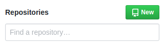
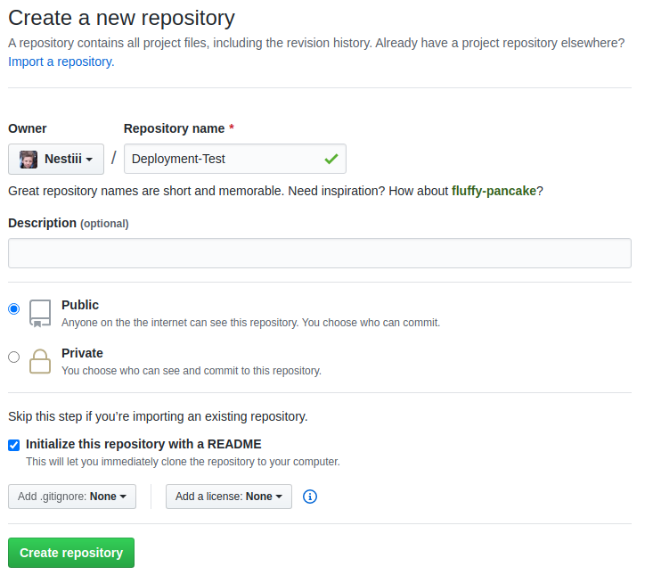
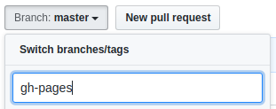
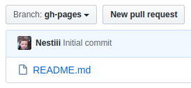
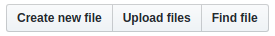
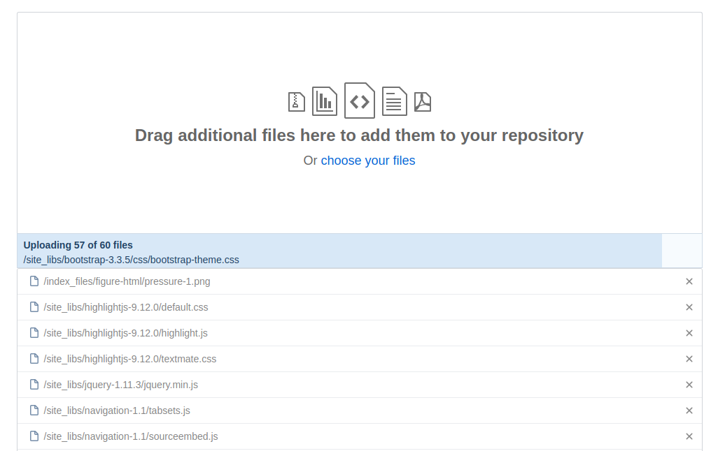

# ¿Qué es el deployment?

Una vez que se finaliza un reporte RMD, es común publicarlo online para visitarlo posteriormente. La acción de publicar el reporte se denomina **"deployment"**. En esta sección estaremos detallando una forma de realizar el deployment donde se utiliza R y [Github](https://github.com/). (Es necesario tener una cuenta, asique es recomendable registrarse antes de seguir con el tutorial).

# Pasos a seguir

1. [Crear el archivo "_site.yml"](#site)
2. [Renderizar el reporte](#render)
3. [Crear repositorio en Github](#createRepo)
4. [Subir los archivos a Github](#upload)

## Crear el archivo "site.yml" {#site}

Antes de renderizar el reporte es necesario crear el archivo "_site.yml", el cual contiene especificaciones e infromación que R necesita para realizar el render. 

El contenido que debe tener el archivo es muy sencillo, aca va un ejemplo del _site.yml de este reporte:

```(r)
name: "R Markdown Deployment"
output: 
  prettydoc::html_pretty:
    theme: cayman
    highlight: github
```

Este archivo debe crearse en el mismo directorio donde se encuentra el reporte RMD. Una vez creado, estamos listos para hacer la renderización.

**IMPORTANTE:** es necesario que el archivo del reporte tenga el siguiente nombre: "index.Rmd"

## Renderizar el reporte {#render}

Este paso es muy sencillo, lo unico que debemos hacer es ejecutar el siguiente comando por consola: 

```(r)
rmarkdown::render_site()
```

Si el render se realizó con éxito, el output de consola deberia ser como el siguiente:

```(r)
Output created: _site/index.html
```

## Crear el repositorio en Github {#createRepo}

Para crear el repositorio donde almacenaremos los archivos del sitio debemos hacer click en el siguiente botón ("new"):

<center>
 
</center>

Luego, le damos un nombre al repositorio, marcamos la opción "initialize this repository with a README" y clickeamos en "Create repository":

<center>
 
</center>

Después de crear el repositorio debemos crear una nueva "branch" que llamaremos **"gh-pages"** (No hace falta entender qué es una branch, con crearla alcanza). Para esto, clickeamos en el botón donde dice "Branch: master", ingresamos "gh-pages" y apretamos enter. Esto crea dicha branch y automáticamente nos posisiona en la misma.

<center>
 
</center>

Branch creada y seleccionada:

<center>
 
</center>

## Subir los archivos a Github {#upload}

Lo que resta es subir los archivos de la carpeta llamada "_site", la cual fue creada por el render y se encuentra en el directorio del reporte. Para esto, con la branch de "gh-pages" seleccionada, clickeamos en "Upload files":

<center>

</center>

Seleccionamos todos los archivos que se encuentran dentro de la carpeta "_site" y los arrastramos para subirlos:

<center>

</center>

Ingresamos un mensaje para el upload de archivos (por ejemplo: "initial commit") y clickeamos en "Commit changes":

<center>

</center>

Una vez que finaliza el upload de los archivos a Github nuestro reporte ya está publicado y podemos acceder a él mediante la siguiente URL:

**[Username de github]**.github.io/**[Nombre del repositorio]**/

Por ejemplo: 

[icassol.github.io/CursoR](https://icassol.github.io/CursoR/)
